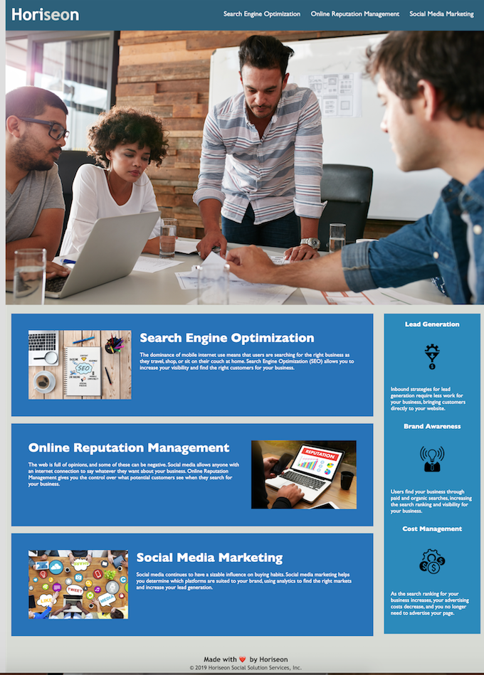

# Horiseon landing page

Accessibility is a key trait among high ranking websites. 

In this project, Horiseon, a growing marketing agency, wants a codebase that follows high accessibility standards. By doing so, their landing page will be optimised for search engines, helping them to reach more clients. 

I did this by incorporating semantic html elements that follow a clear, logical structure that is easy to navigate. 
For example, heading attributes are in sequential order, alt descriptions are added to images and page sections have concise, descriptive titles.

The CSS selectors are consolidated and file is properly commented to 'clean' the code before review.  

## Working links

* Github: https://github.com/mz0121coder/Code-refactor
* Deployed: https://mz0121coder.github.io/Code-refactor/ 

